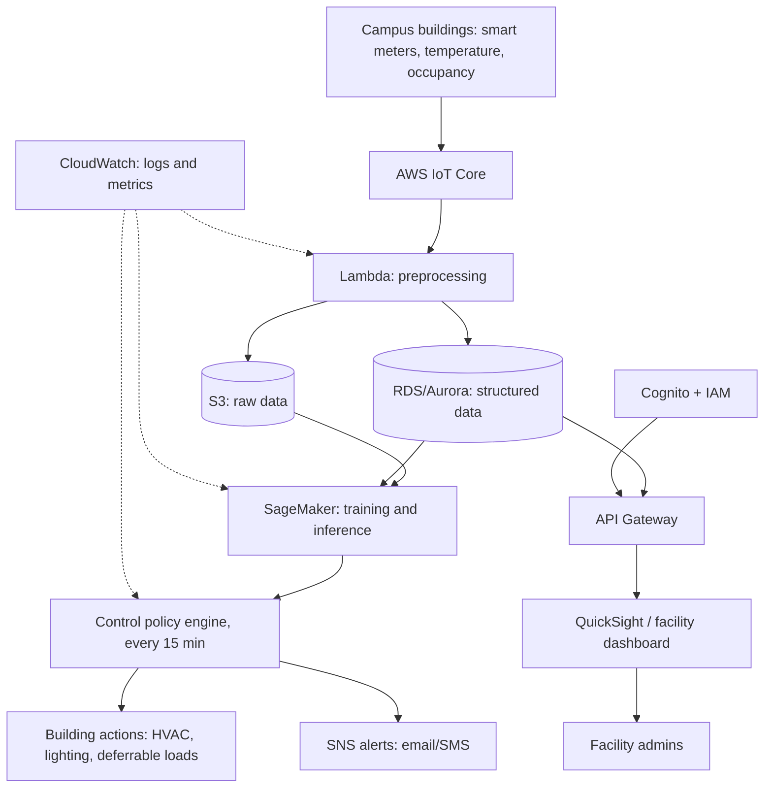
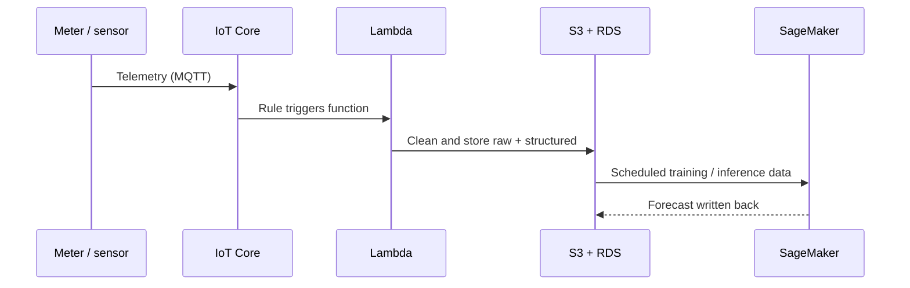
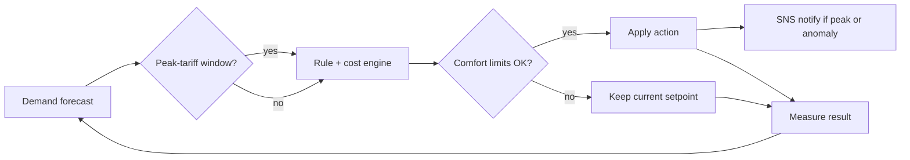
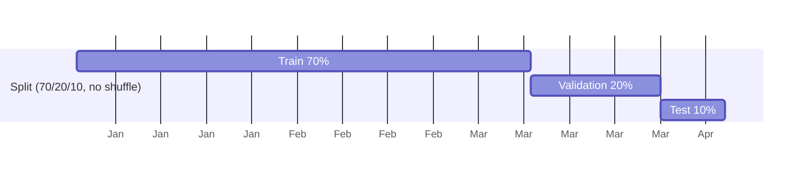

# Architecture Diagrams (Mermaid, rendered by GitHub)

## 1. AWS cloud architecture

```mermaid
flowchart TB
    SENS[Campus buildings: smart meters, temperature, occupancy] --> IOT[AWS IoT Core]
    IOT --> LAM[Lambda: preprocessing]
    LAM --> S3[(S3: raw data)]
    LAM --> DB[(RDS/Aurora: structured data)]
    S3 --> SM[SageMaker: training and inference]
    DB --> SM
    SM --> POL[Control policy engine, every 15 min]
    POL --> ACT[Building actions: HVAC, lighting, deferrable loads]
    POL --> SNS[SNS alerts: email/SMS]
    DB --> API[API Gateway]
    COG[Cognito + IAM] --> API
    API --> DASH[QuickSight / facility dashboard]
    DASH --> ADM[Facility admins]
    CW[CloudWatch: logs and metrics] -.-> LAM
    CW -.-> SM
    CW -.-> POL
```

## 2. Data flow and event trigger

```mermaid
sequenceDiagram
    participant D as Meter / sensor
    participant I as IoT Core
    participant L as Lambda
    participant S as S3 + RDS
    participant M as SageMaker
    D->>I: Telemetry (MQTT)
    I->>L: Rule triggers function
    L->>S: Clean and store raw + structured
    S->>M: Scheduled training / inference data
    M-->>S: Forecast written back
```

## 3. Control loop

```mermaid
flowchart LR
    F[Demand forecast] --> T{Peak-tariff window?}
    T -- yes --> R[Rule + cost engine]
    T -- no --> R
    R --> C{Comfort limits OK?}
    C -- yes --> A[Apply action]
    C -- no --> K[Keep current setpoint]
    A --> N[SNS notify if peak or anomaly]
    A --> M[Measure result]
    K --> M
    M --> F
```

## 4. Chronological evaluation

```mermaid
gantt
    dateFormat YYYY-MM-DD
    axisFormat %b
    section Split (70/20/10, no shuffle)
    Train 70% :a, 2024-01-01, 70d
    Validation 20% :b, after a, 20d
    Test 10% :c, after b, 10d
```
